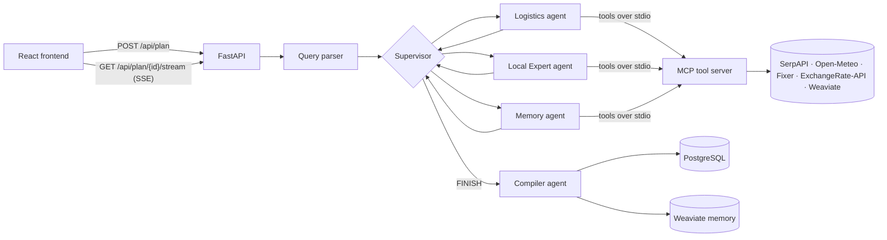

# 🌍 Smart Journey

A travel planning app where a team of AI agents researches and builds your trip. Describe a trip in plain language — *"Plan a 4-day trip from Delhi to Goa in December for 2 people with a budget of ₹80,000"* — and a **LangGraph** supervisor coordinates specialised agents that call real APIs through a **Model Context Protocol (MCP)** server: live flight prices, real hotels and restaurants, historical weather and exchange rates. You watch the agents reason and call tools live, then get a structured plan with an itinerary, budget breakdown, visa notes and a packing list.

---

## ✨ Features

- **Supervisor–worker agents** — a LangGraph supervisor routes work between a Logistics agent, a Local Expert agent and a Memory agent, then a Compiler agent turns their findings into a validated, typed plan.
- **Real data through MCP** — agents call tools on a local MCP server: Google Flights and Google Local (via SerpAPI), Open-Meteo historical weather, and Fixer / ExchangeRate-API for currency.
- **Trip memory** — completed plans are embedded in Weaviate; the Memory agent recalls similar past trips to reuse what worked.
- **Live reasoning terminal** — agent thoughts and tool calls stream to the browser over Server-Sent Events (switch between the *Demo* progress view and the raw *Dev* terminal).
- **Plan dashboard** — itinerary, transport, hotels, food, budget, currency, weather, visa and packing list, with destination photos from Unsplash and PDF export.
- **Trip copilot** — ask follow-up questions about a generated plan.
- **Accounts** — JWT sign-up / login, saved preferences (default origin, currency, dietary needs), rate-limited endpoints.
- **LLM fallbacks** — Gemini is the primary model, with automatic fallback to Groq, a second Gemini key and OpenRouter when configured.

---

## 🧭 How it works



1. `POST /api/plan` creates a planning session.
2. The frontend opens `GET /api/plan/{id}/stream`, which parses the request, then runs the agent graph and streams its progress.
3. The supervisor calls only the agents the request needs. Each worker is a ReAct agent with its own subset of MCP tools:

   | Agent | Tools | Responsibility |
   |---|---|---|
   | Logistics | `search_flights`, `convert_currency` | Flights or ground transport, currency conversion |
   | Local Expert | `search_google_local`, `fetch_typical_weather` | Hotels, restaurants, attractions, weather |
   | Memory | `search_past_itineraries` | Similar trips planned before |
   | Compiler | — | Turns the agents' findings into the typed `TripPlan` schema |

4. The compiled plan is saved to PostgreSQL (and to Weaviate for future recall), and the frontend loads it from `GET /api/plan/{id}`.

The MCP server (`mcp_trip_server/`) is started automatically by the backend as a subprocess over stdio, using the backend's Python environment.

---

## 🛠️ Tech stack

| Layer | Technologies |
|---|---|
| Agents | LangGraph, LangChain, Model Context Protocol (`mcp`, `langchain-mcp-adapters`) |
| LLMs | Gemini (OpenAI-compatible API), Groq, OpenRouter |
| Backend | FastAPI, SQLAlchemy 2 (async) + asyncpg, Alembic, Pydantic, SlowAPI, python-jose |
| Data | PostgreSQL, Weaviate (with a local `text2vec-transformers` embedder) |
| Frontend | React 18, TypeScript, Vite, Tailwind CSS, Framer Motion, TanStack Query |

---

## 📂 Project structure

```text
.
├── docker-compose.yml        # PostgreSQL, Weaviate and the embedding model
├── backend/
│   ├── main.py               # FastAPI app and startup
│   ├── config.py             # Settings loaded from backend/.env
│   ├── database.py           # PostgreSQL engine and Weaviate client
│   ├── api/                  # routes.py (planning, SSE, chat, images), auth.py
│   ├── graph/                # LangGraph pipeline, state, MCP client
│   ├── agents/               # ReAct worker agents and tool wrappers
│   ├── models/               # SQLAlchemy models and Pydantic schemas
│   ├── utils/                # Model router, query parser, memory, auth helpers
│   └── migrations/           # Alembic migrations
├── mcp_trip_server/
│   ├── main.py               # MCP server entry point (stdio)
│   ├── travel_tools.py       # search_flights, convert_currency
│   ├── web_tools.py          # search_google_local, fetch_typical_weather
│   └── db_tools.py           # search_past_itineraries (Weaviate)
└── frontend/
    └── src/
        ├── pages/            # Login, Dashboard
        ├── components/       # Plan wizard, agent terminal, plan and category views
        │   └── sections/     # One component per plan section
        ├── context/          # Auth and trip state
        └── utils/            # PDF export
```

---

## 🚀 Getting started

### Prerequisites

- Python 3.11 or 3.12 (some pinned packages don't have Windows builds for newer versions yet)
- Node.js 18+
- Docker (for PostgreSQL and Weaviate), or your own PostgreSQL instance
- API keys:
  - **Required:** a Gemini API key (or Groq / OpenRouter), and SerpAPI for flights, hotels and restaurants
  - **Optional:** Unsplash (destination photos), Fixer and/or ExchangeRate-API (currency)

### Quick start

One script sets everything up and runs the whole app in a single terminal.

**Windows (PowerShell):**

```powershell
powershell -ExecutionPolicy Bypass -File .\run.ps1
```

**macOS / Linux:**

```bash
./run.sh
```

> **Note:** `run.sh` has been tested on Windows (Git Bash) only — it has not yet been tested on macOS or Linux. If it doesn't work on your system, use the [manual setup](#manual-setup) below and please open an issue.

The script checks the prerequisites, starts PostgreSQL and Weaviate with Docker, creates `backend/.venv`, installs the Python and npm packages, then runs the backend and frontend together and opens the app. Press **Ctrl+C** to stop both servers (the databases keep running; stop them with `docker compose down`).

- **First run:** it creates `backend/.env` (with a generated `SECRET_KEY`) and stops so you can add your API keys. Add them and run it again.
- **Later runs:** packages are only reinstalled when `requirements.txt` or `package-lock.json` change, so startup takes seconds.
- **Options:**

  | `run.ps1` | `run.sh` | Effect |
  |---|---|---|
  | `-SetupOnly` | `--setup-only` | Install everything without starting the servers |
  | `-SkipDocker` | `--skip-docker` | Use your own PostgreSQL instead of Docker |
  | `-NoBrowser` | `--no-browser` | Don't open the browser |

### Manual setup

#### 1. Start the databases

From the repository root:

```bash
docker compose up -d
```

This starts PostgreSQL on `5432`, Weaviate on `8080` and its embedding model. Weaviate is optional — without it, the app runs with trip memory disabled.

#### 2. Set up the backend

```bash
cd backend
python -m venv .venv
source .venv/bin/activate        # Windows: .venv\Scripts\activate
pip install -r requirements.txt  # also installs the MCP server's dependencies
cp .env.example .env             # then fill in your API keys and SECRET_KEY
uvicorn main:app --reload        # http://localhost:8000
```

Tables are created automatically on startup. To manage the schema with Alembic instead, run `alembic upgrade head`.

#### 3. Set up the frontend

```bash
cd frontend
cp .env.example .env
npm install
npm run dev                      # http://localhost:3000
```

Open **http://localhost:3000**, create an account and plan a trip. Interactive API docs are at **http://localhost:8000/docs**.

---

## 🔑 Configuration

All backend settings live in `backend/.env` (see [`backend/.env.example`](backend/.env.example)). The MCP server reads the same file.

| Variable | Required | Purpose |
|---|---|---|
| `GEMINI_API_KEY` | Yes¹ | Primary LLM |
| `GEMINI_MODEL` | No | Model for the supervisor, parser and compiler (default `gemini-2.5-flash-lite`) |
| `GROQ_API_KEY`, `GEMINI_API_KEY_FALLBACK`, `OPENROUTER_API_KEY` | No | LLM fallbacks |
| `SERPAPI_KEY` | Yes | Flight, hotel and restaurant search |
| `FIXER_API_KEY`, `EXCHANGE_RATE_API_KEY` | No | Currency conversion (Fixer first, ExchangeRate-API as fallback) |
| `UNSPLASH_ACCESS_KEY` | No | Destination photos (a default image is used otherwise) |
| `DATABASE_URL` | Yes | PostgreSQL connection string (`postgresql+asyncpg://…`) |
| `WEAVIATE_URL`, `WEAVIATE_API_KEY` | No | Vector memory. Leave the API key empty for the local Docker instance |
| `SECRET_KEY` | Yes | Signs login tokens. If unset, a random key is used and logins reset on restart |
| `ALLOWED_ORIGINS` | No | Comma-separated CORS origins (default `http://localhost:3000`) |

¹ At least one LLM provider key is required.

The frontend reads `VITE_API_URL` from `frontend/.env` (default `http://localhost:8000`).

---

## 📖 API

| Method & path | Description |
|---|---|
| `POST /api/auth/signup`, `POST /api/auth/login` | Create an account / get a JWT |
| `GET /api/auth/me`, `PUT /api/auth/settings`, `PUT /api/auth/change-password` | Account and preferences |
| `POST /api/plan` | Create a planning session from a natural-language request |
| `GET /api/plan/{id}/stream` | Run the agents and stream progress as Server-Sent Events |
| `GET /api/plan/{id}` | Session status and the compiled plan |
| `GET /api/plan/{id}/logs` | Saved agent terminal transcript |
| `POST /api/plan/{id}/chat` | Ask the copilot about a plan |
| `GET /api/image?dest=…` | Redirect to a destination photo |
| `GET /api/health` | Health check |

---

## ⚠️ Troubleshooting

- **"Missing required information: …"** — the parser never invents trip details. Include origin, destination, duration, budget, number of travellers and month, or use the guided wizard.
- **`ModuleNotFoundError: No module named 'mcp'`** — the MCP server runs on the backend's interpreter; install `requirements.txt` inside the activated backend virtual environment.
- **`Weaviate not available` on startup** — the vector database isn't running or is rejecting your API key. Start it with `docker compose up -d`, and leave `WEAVIATE_API_KEY` empty for the local instance.
- **`Connection refused` from PostgreSQL** — check that the database is running and `DATABASE_URL` matches it.
- **`429` / quota errors from Gemini** — free-tier limits are low; add a Groq or OpenRouter key so the agents can fall back.

---

## 🚧 Known limitations

- Planning sessions are linked to the signed-in user, but plan endpoints are not yet restricted to their owner — anyone with a session id can read that plan.
- Flight prices are estimates for the middle of the requested month, since requests describe a month rather than exact dates.
- There is no automated test suite yet.
